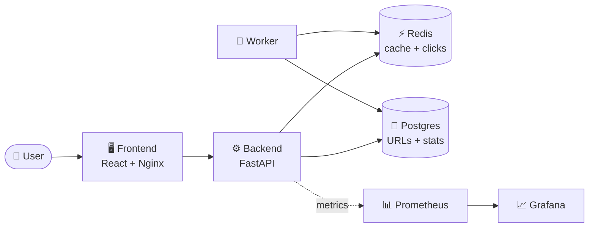
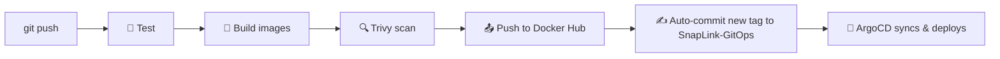

# 🔗 SnapLink

A URL shortener built as a DevOps/GitOps capstone project — the app itself is intentionally simple; the focus is the deployment pipeline around it.

📦 **Live GitOps config & full architecture writeup:** [SnapLink-GitOps](https://github.com/JananiUpeksha/SnapLink-GitOps)

---

## 🧱 Stack

| Layer | Tech |
|---|---|
| Backend | Python, FastAPI, SQLAlchemy |
| Database | PostgreSQL |
| Cache | Redis (URL cache + click counters) |
| Frontend | React + Vite, served via Nginx |
| Worker | Standalone background process |
| Observability | Prometheus + Grafana |

---

## 🏗️ Architecture



---

## ✨ Features

- 🔗 `POST /shorten` — shorten a URL, cache it immediately for a fast first read
- ↪️ `GET /{code}` — redirect to the original URL (Redis cache first, Postgres on a miss)
- 📊 `GET /stats/{code}` — click count and metadata for a short link
- 🛡️ Rate limiting on `/shorten` (5 requests/minute per IP)
- 📈 Prometheus metrics at `/metrics` — request rate, latency, cache hit/miss ratio

---

## 🚀 Running locally

```bash
docker compose up --build
```

| Service | URL |
|---|---|
| 🖥️ Frontend | http://localhost:5173 |
| ⚙️ Backend API | http://localhost:8000 |
| 📈 Backend metrics | http://localhost:8000/metrics |

---

## 📁 Project structure

```
backend/    FastAPI app, SQLAlchemy models, Redis client, rate limiting
frontend/   React SPA — shorten form + stats lookup
worker/     Background job: flushes Redis click counts to Postgres every 10s
```

---

## 🔄 CI/CD

Every push to `main` triggers a GitHub Actions pipeline:



See the [SnapLink-GitOps README](https://github.com/JananiUpeksha/SnapLink-GitOps) for the full pipeline architecture, staging/production promotion flow, disaster-recovery notes, and design decisions.
